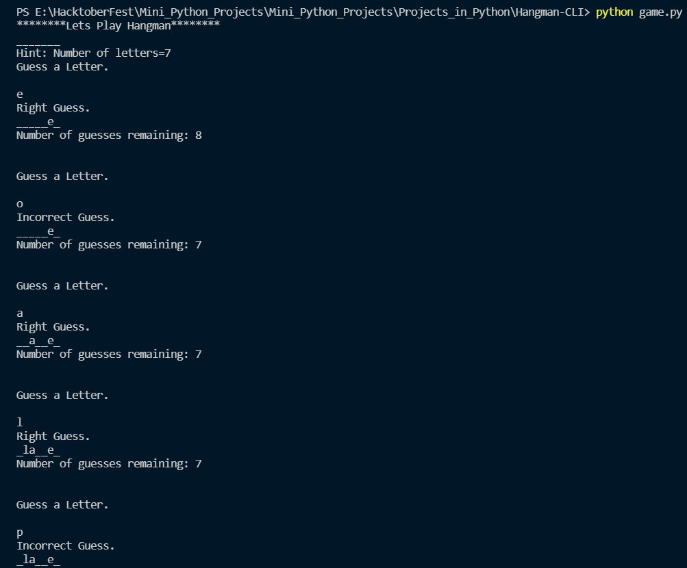
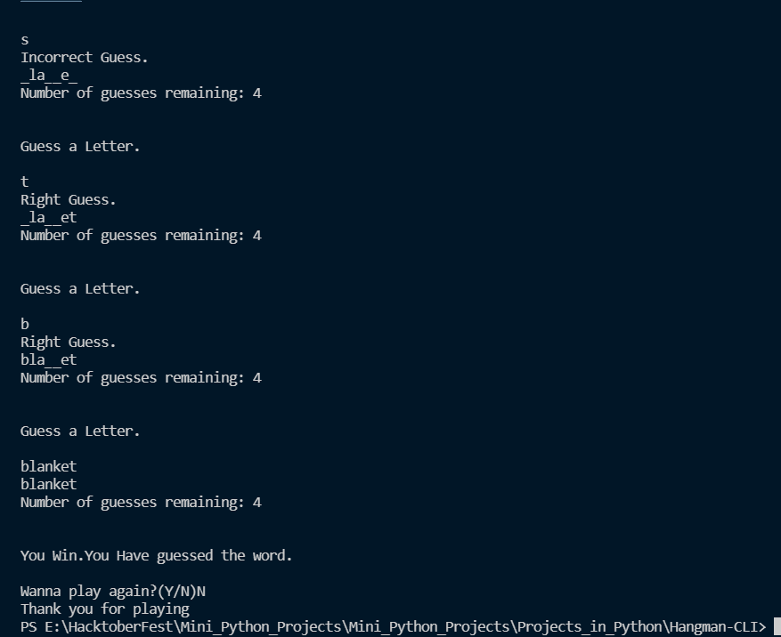

# Hangman-CLI in Python
### A project by prathameshkurunkar7

Hangman is a popular word play game. Hangman-CLI is a Command Line Interface based representation of the game.
## Features

- No external Dependency
- Built with simplicity
- Consists of over 6k+ words

