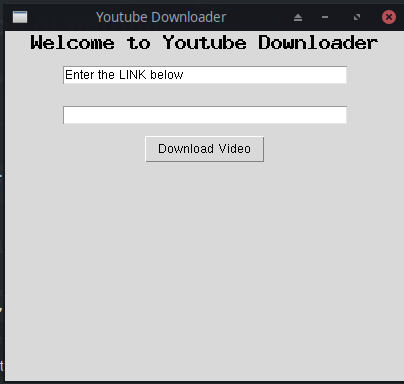

# PYTHON_PROJECTS

This repository contains **Some mini projects** implemented in **Python**

## [FlaskAPI](FlaskAPI)

* Data Structures for python developers with Flask

## [Python_GUI](Python_GUI)

* Python GUI(Graphical User Interface) applications using **Tkinter** python library.
  * TIC TAC TOE game
  * Python Calculator

  

  * Youtube Video Downloader

  
  
* This project uses python to make a Graphical user interface for a Job Application Portal.

  

### [Pygame Tutorial](Pygame_tutorial)

* BouncingBall
* Snake Game
* Space Invadors

### Python WebApp

* [Pure Web Application](python_webapp/README.md)

### Command Line Tool

* [commandline_tool](commandline_tool/Command%20Line%20Tool.ipynb)

### Python Ceaser Cipher

---

## Author

[Kumar Shanu](https://github.com/its-Kumar/)
